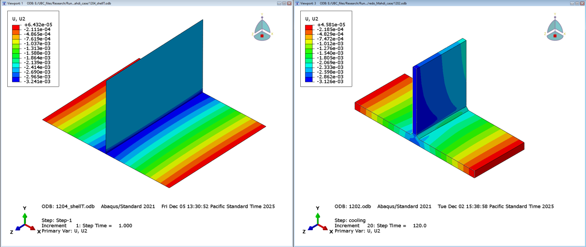
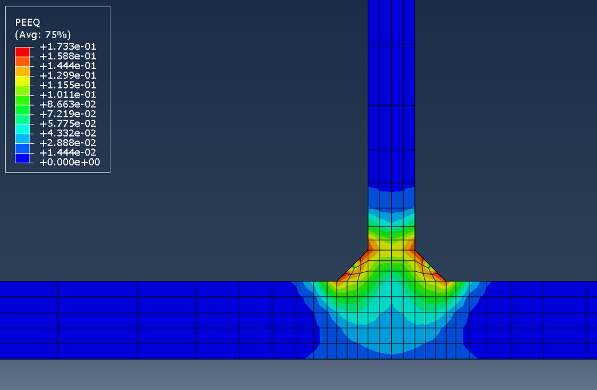
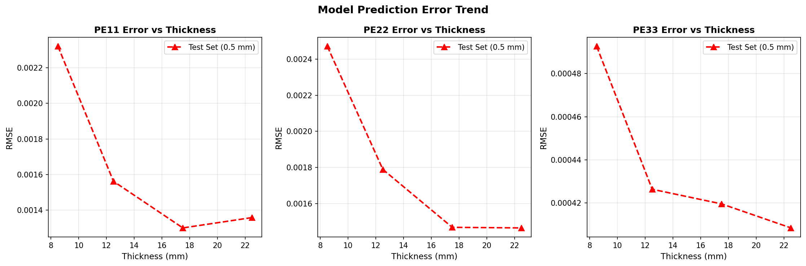
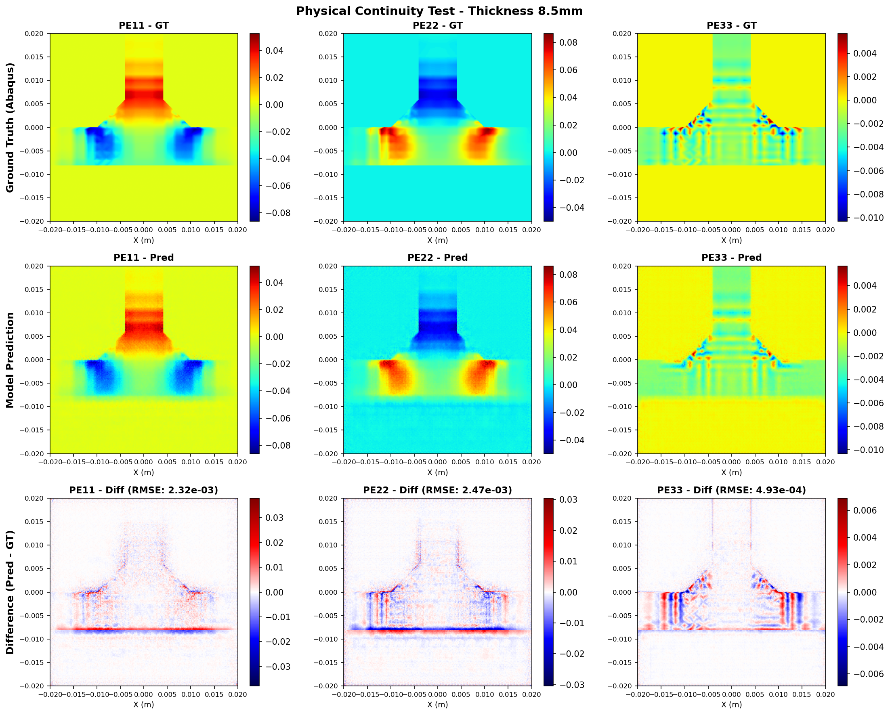

# CNN_InSM_New (Inherent Strain Method with Deep Learning)

## Project Overview

This project `CNN_InSM_New` aims to combine **Deep Learning** with the **Inherent Strain Method (InSM)** to achieve fast and efficient prediction of complex plastic strains (such as PE11, PE22, PE33) during the welding process. The core of this research is to replace or accelerate the traditional and time-consuming Finite Element Analysis (FEA) through a data-driven approach.

This project is a long-term, modular research endeavor that will encompass comparisons and evolutions of various different deep learning model architectures in the future.

## Overall Architecture

The entire project is divided into the following main modules:

```text
CNN_InSM_New/
├── data_input/           # Unified data storage and management module
│   ├── abaqus_data/      # Raw CSV or ODB data exported from Abaqus
│   └── numpy_data/       # NumPy format data (.npy, .png) after preprocessing and interpolation conversion
│
├── handler/              # Data processing and generation script tool library
│   ├── get_data_from_odb.py # Extracts node coordinates and strain data from Abaqus ODB result files
│   └── csv_to_npy.py        # Converts extracted tabular data into regular grid images or matrix data via 2D/3D interpolation for CNN use
│
├── TripleHead/           # [Model Scheme 1] Branch optimization model based on a triple-head decoder
│   ├── models/           # Model architecture definition code (e.g., triple_head_model.py)
│   ├── scripts/          # Scripts for training, tuning (Optuna), and physical continuity verification
│   └── ...               # Other components specific to the TripleHead model (see README in that directory)
│
└── Ideation.docx           # Document recording project iteration ideas, theoretical derivations, and experimental designs (Ideation doc)
```

## Performance & Visual Results

### 1. ISM Efficiency: Shell vs. Solid Comparison
By implementing the **Inherent Strain Method (ISM)**, we transform a computationally expensive temperature-displacement elastic-plastic model into a significantly faster linear elastic model.
- **Simulation Time Reduction**: **98%** (Minutes vs. Seconds)
- **File Size Reduction**: **96%**


*Figure 1: Comparison between the full solid model and the optimized shell-based ISM model.*

### 2. Strain Distribution (PEEQ)
The following contour plot demonstrates the Equivalent Plastic Strain (PEEQ) distribution across the T-joint cross-section as calculated by the Abaqus ground truth model.

*Figure 2: Section view of the target strain distribution (Ground Truth).*

### 3. Deep Learning Validation: Physical Continuity Test
Our `TripleHead` model is validated through a **Physical Continuity Test**, ensuring that predictions remain accurate and physically consistent across various material thicknesses (even those not explicitly seen during training).

| Error Trend | Prediction vs. Ground Truth (T=8.5mm) |
| :---: | :---: |
|  |  |
| *RMSE Trend across thicknesses* | *Detailed component comparison (PE11, PE22, PE33)* |

> [!NOTE]
> For more detailed validation results, including comparison plots for other thicknesses (12.5mm, 17.5mm, 22.5mm, etc.), please refer to the [TripleHead Results directory](TripleHead/results/Web9mm/continuity_test).

## Module Description

### 1. `handler/` (Data Preprocessing and Generation)
The upper limit of a machine learning model is determined by the data. This folder contains all the customized scripts used to convert the data output by traditional industrial software (Abaqus) into a matrix format easily acceptable by deep learning:
- **`get_data_from_odb.py`**: An automated script that batches the extraction of nodal physical quantities derived from simulation by mounting the Abaqus Python environment.
- **`csv_to_npy.py`**: Since the mesh output by Abaqus is usually irregular, this script is responsible for mapping the extracted physical quantities into a regular 256x256 (or custom) pixel grid, and saving them as `.npy` arrays directly read by the model, as well as `.png` images for easy visual inspection.

### 2. `data_input/` (Unified Data Pool)
All datasets relied upon by different models must be unified and fixed to conduct **fair benchmark testing**:
- **`abaqus_data/`**: Saves uninterpolated physical point coordinates and strain values, typically as `.csv`.
- **`numpy_data/`**: Stores tensor data (including interpolated thickness files for model validation) that can be directly fed into the PyTorch DataLoader after interpolation.

### 3. Model Variants
The project aims to explore the performance differences of various neural network structures in predicting inherent strains. We will continuously add new prediction models to this root directory in the future. Currently it includes:
- **`TripleHead/`**: This is an architecture specifically designed for predicting welding residual strains. It utilizes a shared basic feature extraction layer (Backbone) and separates three independent Decoder prediction heads at the backend, which are responsible for learning and outputting PE11, PE22, and PE33 respectively, while utilizing an adjustable component-weighted loss (HAZ loss) to balance magnitude differences.

*(Future plans include the addition of more temporal models or Transformer-based models, and Physics-Informed Neural Networks - PINNs)*

## Quick Start Guide

1. **If you are a researcher responsible for generating data**:
   Please primarily focus on the various scripts under `handler/`, which teach you how to establish the workflow from Abaqus `.odb` to `data_input/numpy_data/`.
2. **If you are a researcher responsible for improving algorithms**:
   You can directly use the prepared datasets in `data_input/numpy_data/`. Enter the model subproject of interest (e.g., `TripleHead/`), and read the corresponding `README.md` within that subdirectory to begin training and testing.

## Author
Runze Shi
